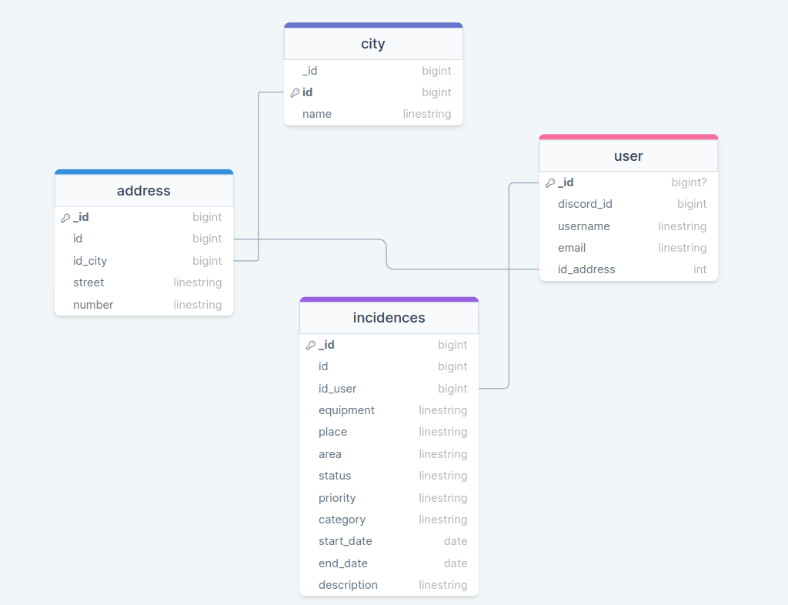

# Incidencias Managment

Este proyecto tiene como objetivo desarrollar un sistema de administración de un zoologico usando temas tales como:

Consultas MongoDb 
Autenticacion a traves de Discord
Sesion de usuarios
Validacion de colecciones
Validacion con DTO
CRUD Funcional
Context, Props, etc... en React
Diseño responsive
Animaciones y transiciones con framer motion

## Diagrama MER

## Funcionalidades principales
    1. Sistemas de autenticacion con discord
    - Autenticar al usuario mediante la API de Discord para obtener información del perfil del usuario.
    - Guardar los datos obtenidos por el sistema de autenticación (token, id_usuario).
    - Si el usuario no existe en el servidor se creara dentro del mismo
    2. Gestion de Incidencias
    -    - **Añadir Incidencias:** Permite a los usuarios añadir incidencias dinamicamente
    - **Eliminar Incidencia:** Elimina una incidencia seleccionada por el usuario
    - **Actualizar Incidencia** Actualiza las propiedades de una incidencia seleccionada por el usuario
    

